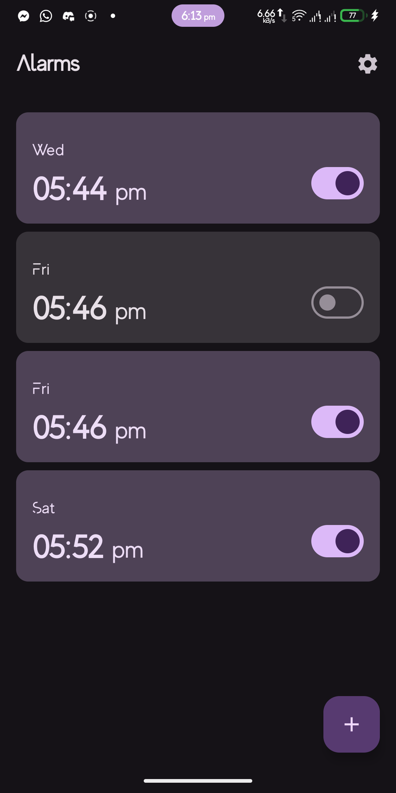
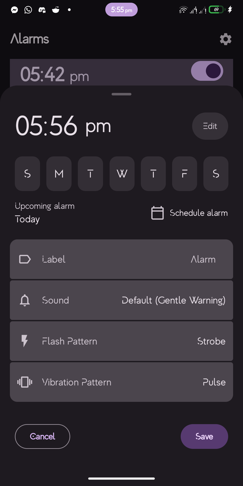
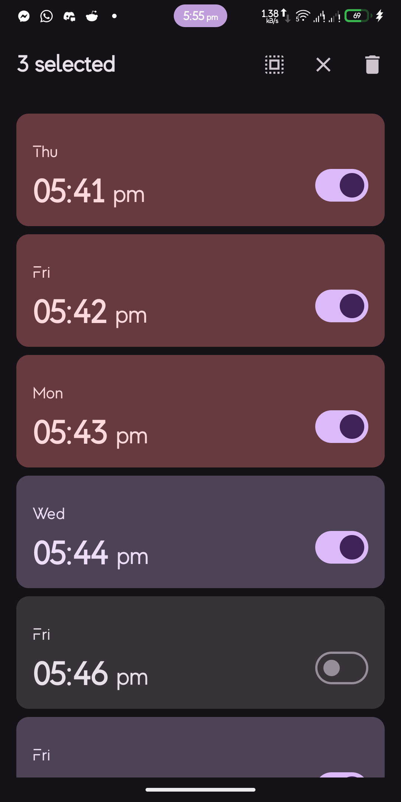
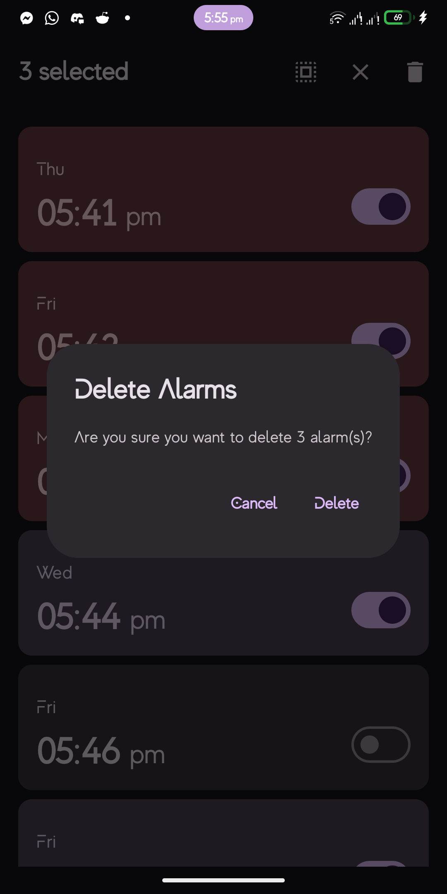
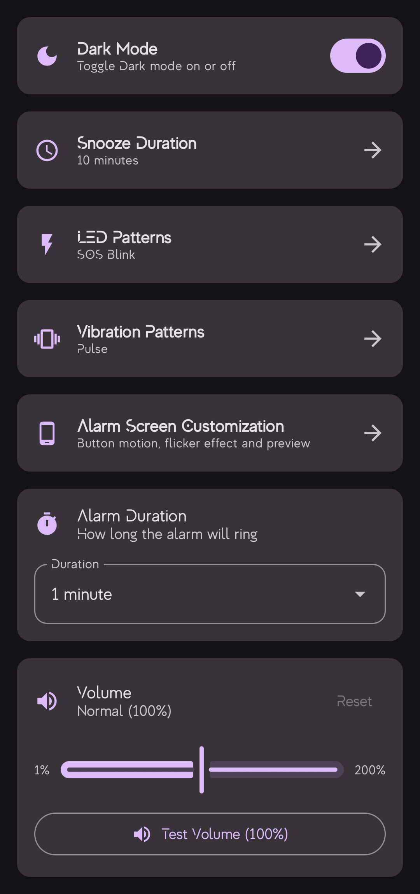
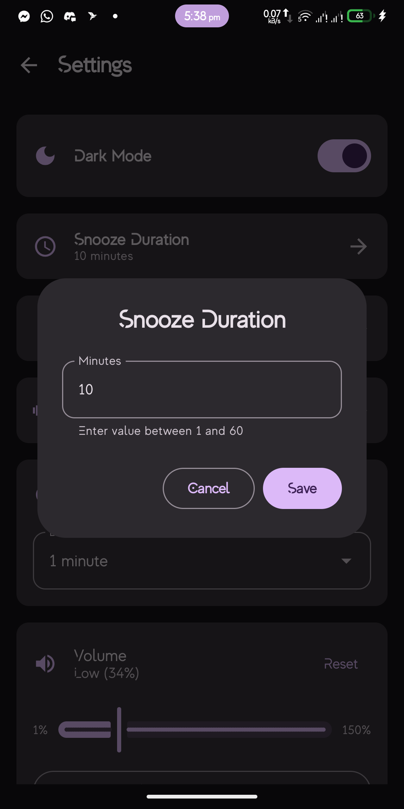
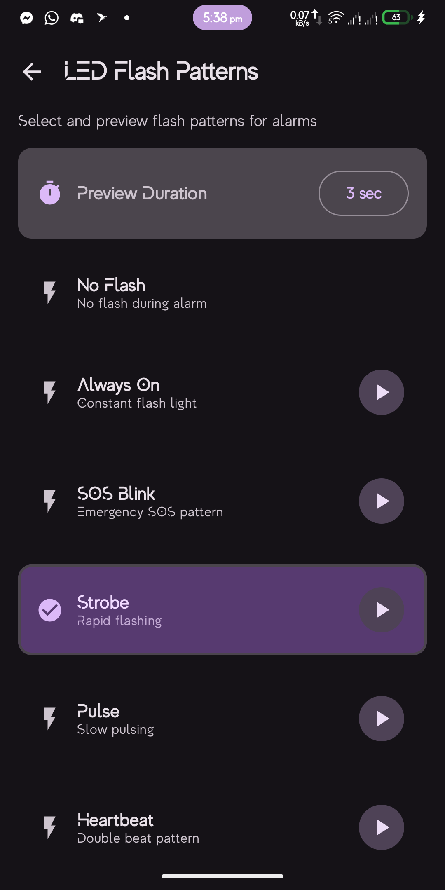
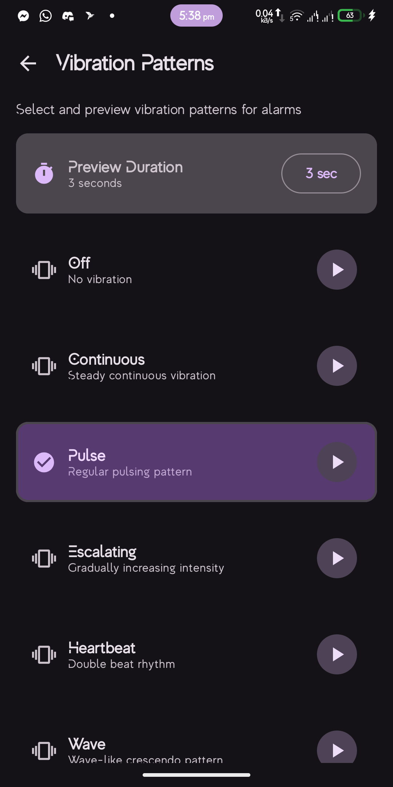
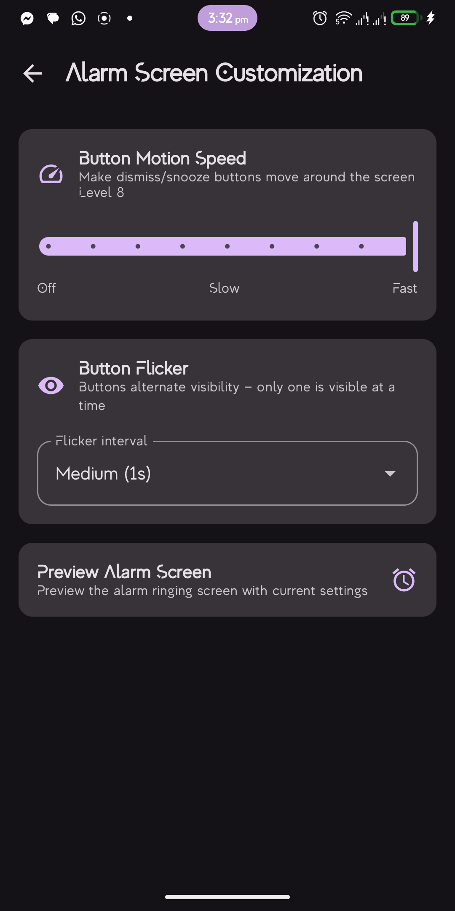

# KrazyAlarm ⏰💡

**Never miss an alarm again!** 🔦✨


Built with modern Android architecture, KrazyAlarm combines **powerful flash alerts** ⚡ with traditional alarm features to ensure you never oversleep. Whether you're in a loud environment, have hearing difficulties, or simply need an extra boost to wake up, the **bright, attention-grabbing flash patterns** will get you out of bed! 🌅

### 🔦 Why Flash Alerts?
- **💡 Visual Wake-Up**: Bright camera flash patterns that can't be ignored
- **🔇 Silent Yet Effective**: Perfect for shared spaces or quiet environments  
- **♿ Accessibility**: Essential for users with hearing impairments
- **⚡ Customizable Patterns**: Choose from Strobe, SOS, Heartbeat, Pulse, and more
- **🎯 Attention-Grabbing**: Combines light, sound, and vibration for maximum effectiveness

## 📱 Screenshots

<div align="center">
  
  
  
  
</div>

<div align="center">
  
  
  
  
  
</div>

### 🎮 Moving Buttons Challenge

<div align="center">
  <a href="screenshots/06.1.mp4">▶️ Alarm Screen - Moving Buttons</a>
  &nbsp;&nbsp;
  <a href="screenshots/06.2.mp4">▶️ Alarm Screen - Moving Buttons with Flicker</a>
</div>

*The alarm screen features moving dismiss/snooze buttons that bounce around the screen with physics-based collision detection, making it harder to accidentally dismiss your alarm while half-asleep!*


## ✨ Features

### 🔦 Flash Alert System (Main Feature)
- **⚡ Advanced Flash Patterns**
  - **Strobe** - Rapid, intense flashing for maximum alertness
  - **SOS** - Emergency signal pattern (···---···)
  - **Heartbeat** - Rhythmic pulsing like a heartbeat
  - **Pulse** - Smooth fade in/out pattern
  - **None** - Traditional alarm without flash
  
- **📸 Camera Flashlight Integration**
  - Uses device camera LED for bright, visible alerts
  - Works even when screen is off
  - Optimized for battery efficiency
  - Automatically stops when alarm is dismissed

### Core Functionality
- **Flexible Alarm Scheduling**
  - One-time alarms with specific date selection
  - Recurring alarms with custom day selection (Sunday-Saturday)
  - Smart alarm time calculation for next occurrence
  - Queue management for consecutive alarms

- **Customizable Alarms**
  - Custom labels for each alarm
  - Adjustable snooze duration
  - Configurable alarm duration (1-5 minutes)
  - System ringtone picker integration

### 📳 Haptic Feedback
- **Vibration Patterns**
  - Continuous, Pulse, Wave, Alert
  - Customizable vibration intensity
  - Synchronized with flash patterns for multi-sensory alerts

### Audio Enhancement
- **Volume Boost**
  - System volume control up to 100%
  - Audio enhancement up to 150% using LoudnessEnhancer
  - Volume slider with real-time preview

### Alarm Dismissal Challenge
- **Moving Buttons**
  - Dismiss and Snooze buttons that move around the screen
  - Physics-based collision detection
  - Adjustable motion speed (0-5 levels)
  - Prevents accidental alarm dismissal

### User Experience
- **Dark Mode Support**
  - System-wide dark theme support
  - Persistent theme preference

- **Intuitive UI**
  - Material Design 3
  - Bottom sheet modals for alarm creation/editing
  - Real-time alarm preview
  - Smart snackbar notifications with countdown

- **Batch Operations**
  - Select multiple alarms
  - Bulk delete functionality
  - Select all option

## 🏗️ Architecture

### Clean Architecture + MVVM

The app follows Clean Architecture principles with MVVM pattern for the presentation layer:

```
┌─────────────────────────────────────────────────────────┐
│                    Presentation Layer                    │
│  ┌────────────────────────────────────────────────────┐ │
│  │  UI (Jetpack Compose)                              │ │
│  │  - Screens, Components, Theme                      │ │
│  └────────────────────────────────────────────────────┘ │
│  ┌────────────────────────────────────────────────────┐ │
│  │  ViewModels                                        │ │
│  │  - State Management, UI Logic                     │ │
│  └────────────────────────────────────────────────────┘ │
└─────────────────────────────────────────────────────────┘
                          ↕
┌─────────────────────────────────────────────────────────┐
│                     Domain Layer                         │
│  ┌────────────────────────────────────────────────────┐ │
│  │  Use Cases                                         │ │
│  │  - Business Logic                                  │ │
│  └────────────────────────────────────────────────────┘ │
│  ┌────────────────────────────────────────────────────┐ │
│  │  Domain Models & Repository Interfaces            │ │
│  └────────────────────────────────────────────────────┘ │
└─────────────────────────────────────────────────────────┘
                          ↕
┌─────────────────────────────────────────────────────────┐
│                      Data Layer                          │
│  ┌────────────────────────────────────────────────────┐ │
│  │  Repository Implementation                         │ │
│  └────────────────────────────────────────────────────┘ │
│  ┌────────────────────────────────────────────────────┐ │
│  │  Data Sources                                      │ │
│  │  - Room Database (Local)                          │ │
│  │  - DataStore (Preferences)                        │ │
│  └────────────────────────────────────────────────────┘ │
└─────────────────────────────────────────────────────────┘
```

### Technology Stack

#### UI Layer
- **Jetpack Compose** - Modern declarative UI toolkit
- **Material Design 3** - Latest Material Design guidelines
- **Compose Navigation** - Type-safe navigation
- **Accompanist** - Compose utilities (System UI Controller)

#### Architecture Components
- **ViewModel** - UI state management
- **StateFlow** - Reactive state management
- **Kotlin Coroutines** - Asynchronous programming
- **Flow** - Reactive data streams

#### Data Persistence
- **Room Database** - Local database with SQL abstraction
- **DataStore** - Modern preferences storage
- **Type Converters** - Custom data type support

#### Dependency Injection
- **Koin** - Lightweight dependency injection framework

#### Background Processing
- **WorkManager** - Deferrable background work
- **AlarmManager** - Exact alarm scheduling
- **Foreground Service** - Alarm ringing service

#### Media & Hardware
- **MediaPlayer** - Audio playback
- **LoudnessEnhancer** - Audio amplification beyond system limits
- **Camera2 API** - Flashlight control
- **Vibrator** - Haptic feedback

### Project Structure

```
app/
├── data/
│   ├── local/
│   │   ├── database/        # Room database, DAOs, entities
│   │   └── preferences/     # DataStore implementation
│   ├── repository/          # Repository implementations
│   └── scheduler/           # AlarmManager integration
├── domain/
│   ├── models/              # Domain models
│   ├── repository/          # Repository interfaces
│   ├── usecase/             # Business logic use cases
│   └── util/                # Domain utilities
├── presentation/
│   ├── screen/              # UI screens
│   │   ├── alarm_list/      # Main alarm list screen
│   │   ├── DetailsModal/    # Alarm creation/edit modal
│   │   ├── ringing/         # Alarm ringing screen
│   │   └── settings/        # Settings screen
│   ├── service/             # Foreground services
│   ├── theme/               # App theme and styling
│   └── util/                # UI utilities
├── di/                      # Dependency injection modules
└── worker/                  # WorkManager workers
```

## 🛠️ Build & Run

### Prerequisites
- Android Studio Hedgehog or later
- JDK 17 or higher
- Android SDK 34
- Gradle 8.2+

### Setup
1. Clone the repository
```bash
git clone <repository-url>
cd KrazyAlarm
```

2. Open the project in Android Studio

3. Sync Gradle files

4. Run the app on an emulator or physical device

### Required Permissions
- `POST_NOTIFICATIONS` - For alarm notifications
- `SCHEDULE_EXACT_ALARM` - For precise alarm scheduling
- `VIBRATE` - For vibration patterns
- `CAMERA` - For flashlight (flash patterns)
- `FOREGROUND_SERVICE` - For alarm ringing service
- `WAKE_LOCK` - To wake up device for alarms

## 📦 Dependencies

See [libs.versions.toml](gradle/libs.versions.toml) for complete dependency list.

Key dependencies:
- Kotlin 1.9.22
- Compose BOM 2024.02.00
- Room 2.6.1
- Koin 3.5.3
- DataStore 1.0.0
- WorkManager 2.9.0
